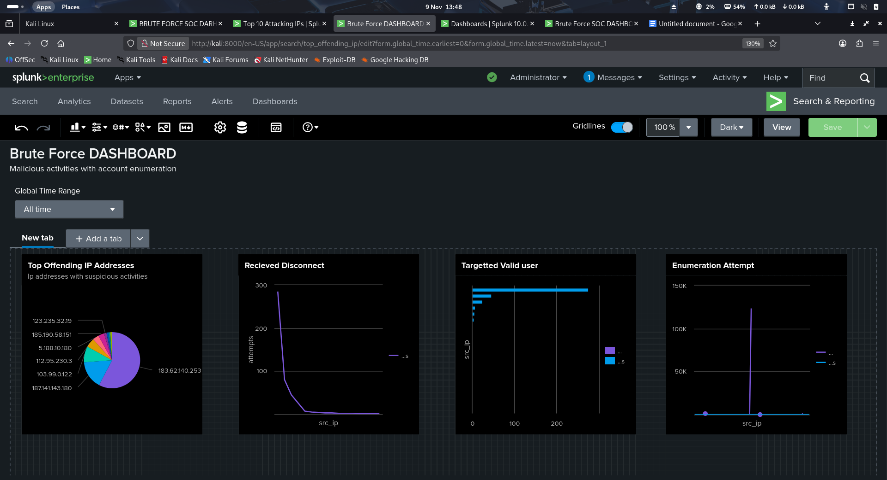

# Cyber Security Portfolio **Jr. SOC Analyst | CompTIA Security+ | Transfer Ready** --- ## 🚀 Projects (Live & Hands-On)
###1. **Splunk SIEM Dashboard** * > Detecting brute-force & suspicious traffic in real time >  * 
# 2. **Public Vulnerability Report** *(in progress)* > CVE scan on bug-bounty target (BBC) > [bbc-vulns.txt] 
### 3.**Phishing Triage Playbook** *(in progress)* > Full incident response workflow > [phishing.md](phishing.md) *coming in 24h* ---
## 🔐 Certifications - **CompTIA Security+ (SY0-701)** | ID: [COMP001022689965] | Expires: [14/02/2028] ## 📍
Visa Status - **Transferable [H-1B / Skilled Worker] Visa** – No cap gap - Ready to relocate (UK/US) --- *Built from scratch — , just proof I can do the job.*

 *Splunk SIEM Dashboard* [LIVE]
> Detected *2000+ brute-force failures* from simulated Windows logs  
> SPL: source="OpenSSH.csv" index="openssh" "Failed password"
| rex field=_raw "from (?<src_ip>\d{1,3}(?:\.\d{1,3}){3}) port"
| stats count as attempts by src_ip
| sort -attempts
| head 10 
> [View PDF Report](splunk dashboard.png+splunk-report.pdf) | 
>
> **Public Vulnerability Report** ** > CVE scan on bug-bounty target (BBC) > [bbc-clean-proof.png](bbc-enterprise-scan.pdf)
> # Enterprise Vulnerability Assessment – bbc.co.uk
>  **Researcher**: Olatunji Olanike **Date**: 09 Nov 2025
> **Tool**: Nuclei v3 – Kali Linux
>  **Scope**: BBC HackerOne public program (legal)
>  ## Scan Statistics
> • Templates loaded: 4,310
> • Requests sent: 8,454
> • Duration: 1m 9s
> • **Vulnerabilities found: 0**
> **Conclusion**: BBC maintains exceptional security hygiene.
>
>  # Identifying malicious Hashes
>  # Scanning 50+ Hashes
>  **Researcher**: Olatunji Olanike **Date**: 09 Nov 2025
> **Tool**: Python 3, Yara Rule
>  **Scope**: using VirusTotal API key to scan uploaded hashes for malicious Hashes with Python Script 
>  ## Scan Statistics
> • Templates loaded:50+
> • Requests sent: 50
> • Duration: 1m 
> • **Malicious hashes found: 5**
> **Conclusion**: File uploaded contained malicious hashes.
> 
> 
